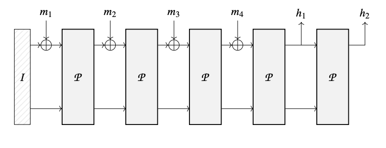
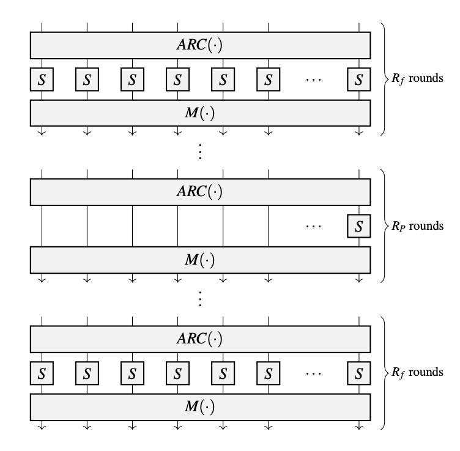

# Poseidon Hasher
Poseidon Hasher is a mapping over strings of $F_p$ (for prime $p > 2^{31}$) such that it maps $F_p^* \to F_p^o$ where $o$ is the number of output elements (often chosen value is $o = 1$).

Poseidon is said to be a variant of *HadesMiMC* construction however with a fixed and known key.

## A primer on sponge construction
Sponge construction looks as follows:

In this, the $I$ is maintained state that changes over time, $m_x$ are injected values to be hashed and $h_y$ are the output elements.

General construction looks as follows:
- Depending on the use case, determine the capacity element value and the input padding if needed.
- Split the obtained input into chunks of size $r$.
- Apply the permutation to the capacity element and the first chunk.
- Until no more chunks are left, add them into the state and apply the permutation.
- Output $o$ output elements out of the rate part of the state.
If needed, iterate the permutation more times.

## The HADES design strategy
The HADES design strategy consists of:
- First, $R_f$ rounds in the beginning, in which S-boxes
are applied to the full state. 
- Next, $R_p$ rounds in the middle contain single S-box application. Rest of the state goes through this phase unchanged
- Finally, $R_f$ rounds in the end, in which S-boxes
are applied to the full state. 



Each such round consists of the following three sub-steps:
1. $ARC$: Add round constants
2. $SBOX$: Application of S-Boxes
3. $MIX$: Mix layers

## Reference implementation for magic values
Directory `reference/hadeshash` includes `generate_params_poseidong.sage` for generating values used inside poseidon hasher. We build values for BLS12-381's $F_q$ a.k.a Scalar Field. For this, use:

```sh
# For generating for BLS12-381 Fq;
# Modulus = `52435875175126190479447740508185965837690552500527637822603658699938581184513`
# In Hex that is `0x73EDA753299D7D483339D80809A1D80553BDA402FFFE5BFEFFFFFFFF00000001`
# So, the following command should work:

sage generate_params_poseidon.sage \
    1 # field = 1 for GF(p) \
    0 # s_box = 0 for x^alpha, s_box = 1 for x^(-1) \
    255 # field_size (n) bits \
    3 # num_cells (t) \
    3 # alpha \
    128 # security level \
    0x73EDA753299D7D483339D80809A1D80553BDA402FFFE5BFEFFFFFFFF00000001
```
This generates `poseidon_params_n255_t3_alpha3_M128.txt` file. Using values in this file, we generate values ingested in the rust code.


## References
[ICAR 2019/458](https://eprint.iacr.org/2019/458.pdf)
[Poseidon-ARK GitHub Repository](https://github.com/arnaucube/poseidon-ark/)
